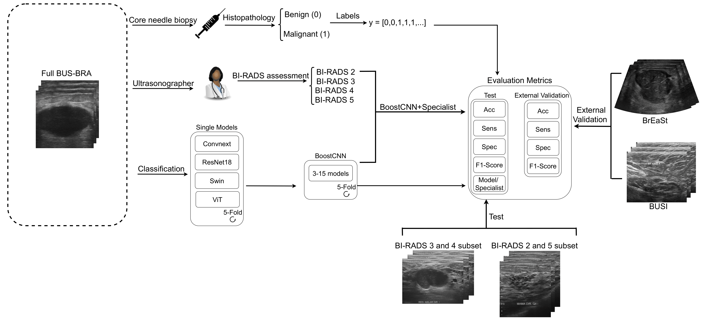

# BoostCNN: Deep Learning AdaBoost-based Method for Easy and Difficult Nodule Classification in Ultrasound Images

## Abstract
Ultrasonography is used as a complementary imaging modality for breast cancer detection because it can detect cases missed by mammography. 
Nevertheless, global recommendations have not reached a
consensus on using ultrasound as the primary screening tool. This is mainly due to its high number of false positives, which can lead to overdiagnosis, unnecessary treatments, surgical interventions, and psychological stress.
Therefore, this paper aims to provide a novel AdaBoost-based ensemble method, called BoostCNN, that could help reduce the rate of false positives and also false negatives of a specialist in ultrasound images of breast cancer. We used the BUS-BRA dataset to train and test four state-of-the-art deep learning models and our proposed BoostCNN. Then, for External Validation, we evaluated our methodologies on the BUSI and BrEaSt datasets.
We obtained metrics for different number of models in the ensemble, highlighting the BoostCNN with 9 models, which achieved an accuracy of 88.07±3.23\%, sensitivity of 84.26±6.93\%, specificity of 89.9±2.18\%, and F1-Score of 81.98±5.05\% on the full BUS-BRA dataset.
Furthermore, we also e combined the ultrasonographer assessment and our BoostCNN prediction to evaluate joint
performance, achieving an accuracy of 87.64±2.68\%, sensitivity of 87.39±6.41, specificity of87.78±1.53\%, and F1-Score of 82.0±4.18\%.
These results demonstrate that our methods are a possible tool to enhance specificity in ultrasound breast cancer classification without sacrificing much sensitivity.
---

## Methodology

---
